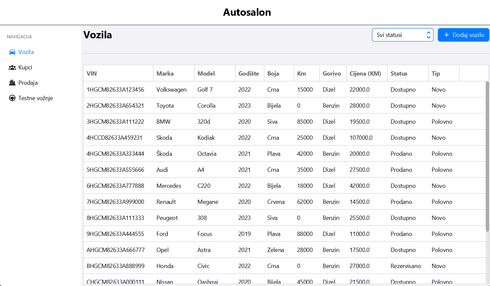
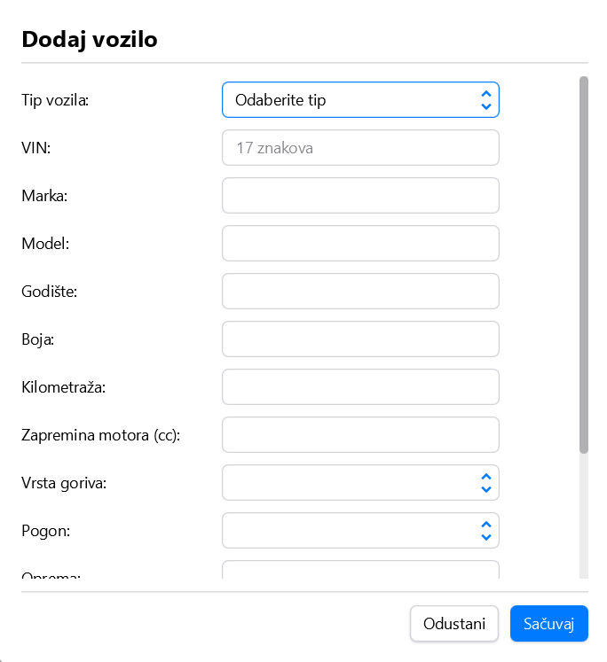
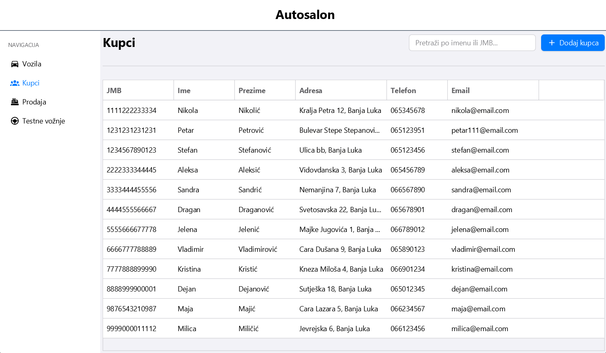
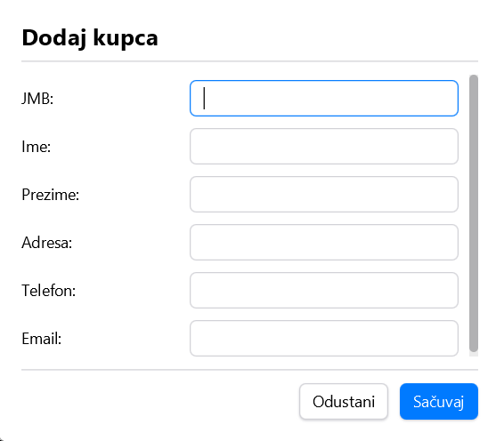
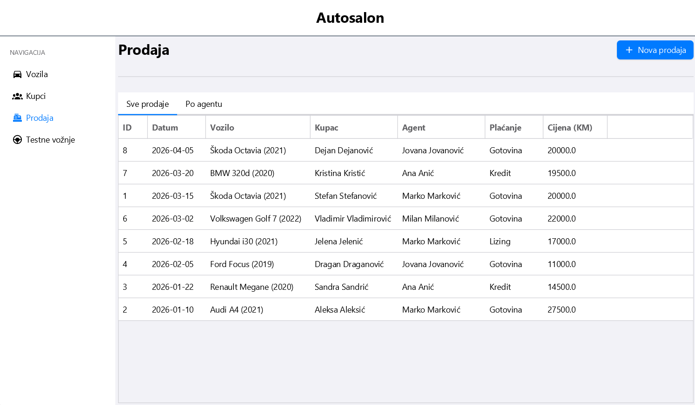
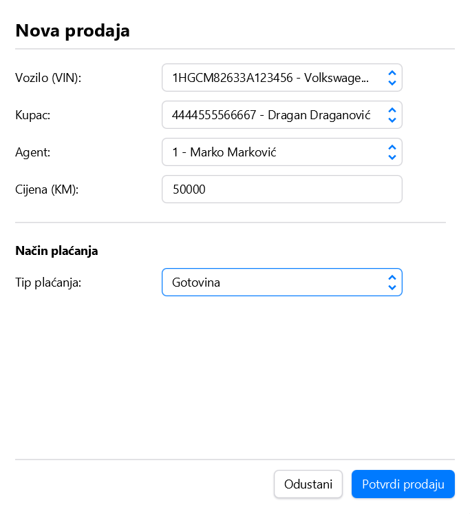
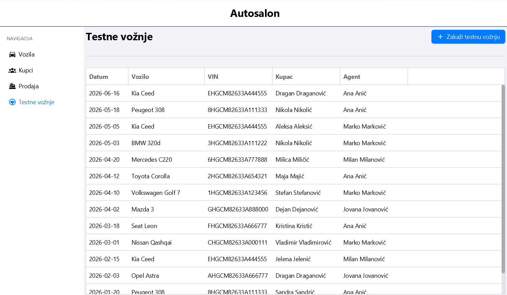
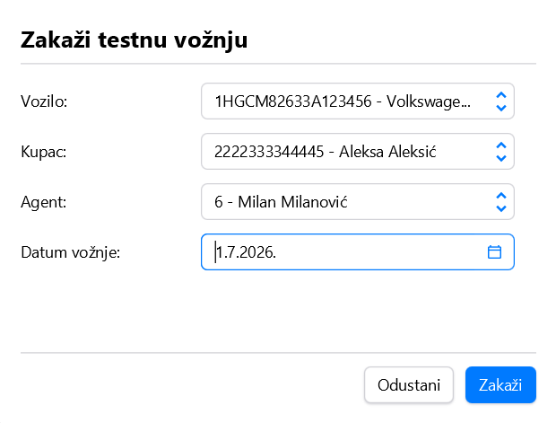

# Autosalon — Car Dealership Management System

A desktop application for managing a car dealership's full business workflow — vehicle inventory, sales, test drives, service work orders, and parts procurement — built on a relational database with business logic enforced at the database level (stored procedures, triggers, views). Developed as a university project for the Databases course, Faculty of Electrical Engineering, University of Banja Luka.

## Overview

The system models a real dealership domain end to end:

- **Vehicle inventory** — new and used vehicles (shared base data + type-specific attributes), technical specs, pricing, and availability status
- **Sales** — agents, customers, sales records, and flexible payment plans (cash, credit, leasing) with installment tracking
- **Test drives** — scheduling and duplicate-booking prevention
- **Service department** — work orders, parts usage, technician assignment, invoicing
- **Procurement** — suppliers, parts orders, stock levels

The domain was deliberately modeled with **table-per-type inheritance** (e.g. `Vozilo` as the shared vehicle entity, with `Novo_Vozilo` / `Polovno_Vozilo` and `Tehnicka_Specifikacija` / `Komercijalni_Podaci` extending it) and **role subtyping** for staff (`Zaposleni` → `Agent` / `Servisni_Tehnicar`), reflecting the conceptual model.

## Database Design

- **18 tables**, full conceptual model and relational schema included ([`konceptualniModel.png`](./konceptualniModel.png), [`konceptualniModel.mwb`](./konceptualniModel.mwb))
- **7 views** for common read patterns (`sva_vozila_info`, `dostupna_vozila_info`, `nova_vozila_info`, `polovna_vozila_info`, `prodaje_info`, `prodaja_po_agentu`, `testne_voznje_info`)
- **8 stored procedures** encapsulating multi-step business operations, e.g. `dodaj_novo_vozilo`, `kreiraj_prodaju`, `rezervisi_vozilo`, `otkazi_rezervaciju_vozila`, `registruj_novog_kupca`, `unos_uplate`
- **8 triggers** enforcing business rules directly in the database, for example:
  - `validacija_cijene` — rejects a sale price lower than the purchase price
  - `provjera_dostupnosti_vozila` / `provjera_dostupnosti_testna_voznja` — blocks selling or test-driving a vehicle that isn't marked available
  - `provjera_duplikat_testna_voznja` — prevents booking the same customer for the same vehicle twice on the same day
  - `promjena_statusa_vozila` — automatically flips a vehicle's status to "Sold" once a sale is recorded

Putting these rules in the database (rather than only in application code) means data integrity holds regardless of which client touches the database.

## Application Architecture

A JavaFX desktop client following a layered **DAO → Service → UI (MVC via FXML controllers)** structure:

```
src/main/java/org/unibl/etf/projekat_bazepodataka/
├── model/       # domain classes mapped to DB tables/views
├── dao/         # JDBC data access (one DAO per entity)
├── service/     # business-facing operations, calls stored procedures via CallableStatement
├── ui/          # JavaFX controllers (one per screen/dialog)
└── util/        # DBKonekcija — JDBC connection management
```

The service layer calls stored procedures directly (e.g. `{CALL kreiraj_prodaju(...)}`) rather than duplicating business logic in Java, so validation stays consistent with the constraints enforced at the database level.

## Features

- Browse and manage vehicle inventory (new/used), with technical and commercial details
- Register customers and record sales, including payment plan and installment setup
- Reserve / release a vehicle, with automatic status tracking
- Schedule and track test drives
- View sales history per agent and dealership-wide

## Tech Stack

- **Java 21**, **JavaFX 21** (Controls, FXML)
- **MySQL** (via `mysql-connector-j`)
- **ControlsFX**, **AtlantaFX**, **Ikonli** (Material Design icons) — UI styling
- **Maven** — build

## Project Structure

```
.
├── Specifikacija informacionih potreba.pdf   # requirements specification
├── konceptualniModel.mwb / .png              # conceptual (ER) model
├── skripta_generisanje_relacione_seme.sql    # DDL — schema creation
├── skripta_generisanje_podataka.sql          # DML — sample data
├── skripta_pogledi_trigeri_procedure.sql     # views, triggers, stored procedures
└── src/main/java/...                         # JavaFX application (DAO/Service/UI)
```

## Screenshots

**Vehicle inventory** — browse all vehicles with status filtering, and the add-vehicle form:




**Customers** — searchable customer list and the add-customer form:




**Sales** — sales history (all sales / by agent) and the new-sale form with payment type selection:




**Test drives** — scheduled test drives and the booking form:




## Getting Started

### Prerequisites
- JDK 21+
- Maven 3.9+
- MySQL 8+

### Database setup

```bash
mysql -u root -p < skripta_generisanje_relacione_seme.sql
mysql -u root -p < skripta_pogledi_trigeri_procedure.sql
mysql -u root -p < skripta_generisanje_podataka.sql   # optional sample data
```

Update the connection details in `DBKonekcija.java` (`URL`, `USER`, `PASSWORD`) to match your local MySQL setup before running the app.

### Run

```bash
mvn clean javafx:run
```

## Notes

Business rule validation (pricing sanity checks, availability checks, duplicate-booking prevention, automatic status transitions) is implemented as **database triggers and stored procedures** rather than solely in application code — a deliberate design choice for this course project to demonstrate enforcing integrity at the data layer.
